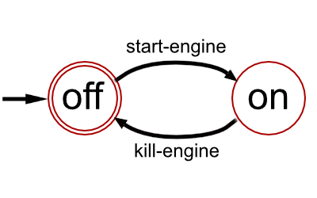
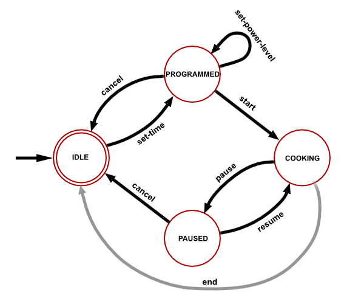
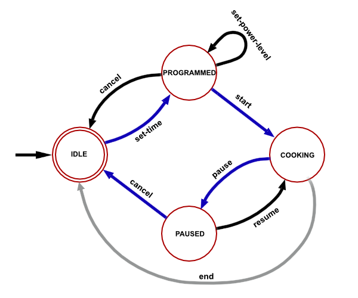

# Microwave Oven State Machine
:arrow_forward: Assignment Starter Code

Welcome to this assignment! :sparkles:

Please consult the course homepage for deadlines.


---

### Do NOT clone `A2-MicrowaveOvenStateMachine-Starter` repository! :warning:

* A copy of this repository is made for you in your GitHub account. 
* The copied repository will appear as `assign2_teamxxx` (where `xxx` is some number). 
* Using IntelliJ, clone that repository and open it. 

---


#### Table of Context:

  * [Overview](#overview)

  * [How To Approach This Assignment](#how-to-approach-this-assignment) 

  * [Submission](#submission)

    

---

### Overview


#### Learning Goals

- given the specification of a data abstraction that represents a state machine, test the abstraction using jUnit


#### Description 

In this assignment you will write a suite of tests to check that an implementation of a state machine for a microwave oven is implemented correctly. So, unlike the previous assignment in which you tested and implemented a specification, in this assignment, given a specification, you will design only the tests and run those tests against an implementation that we provide.

First, we'll describe what a state machine is. Then, we will give you the specification of the state machine for a microwave oven for which you will write tests.

A state machine is an abstraction that is used to describe a system that has a finite number of states and which transitions between states when certain events occur. For example, we could model, or describe abstractly, a car as a state machine. A car is initially in the off state. The event start-engine transitions the car from the off state into the on state, while the kill-engine event transitions the car back into the off state. To make this rudimentary car model more accurate we would add many more events and states to this state machine.

One way of representing a state machine is with a diagram. The car state machine is depicted below. In this diagram a circle represents a state, and arrows between circles represent events. The initial state - the state in which we begin - has an unlabeled arrow to it (for a car state machine, this is the off state). The terminal state - the state in which it is legal for the system to stop executing - is represented with two circles (for a car state machine, this is also the off state).



A microwave oven can also be modeled as a state machine. With just a few states the model can capture a large variety of important and familiar behaviors. Below is a specification, or a description, of a microwave oven as a state machine. In the specification below, as with the car state machine above, the initial and the terminal states are identical - the left-most idle state is both the initial and the terminal state. In this machine, the transitions that are in grey represent internal events - events that are executed by the microwave oven itself. For example, the end event is generated by the microwave unit itself when it has finished cooking for the specified amount of time. 



A state machine is useful for reasoning about control. We typically talk about a path in, or an execution of, the state machine, which is a sequence of alternating states and events that starts in the initial state and ends in the terminal state. Below, a path in the microwave oven state machine has been highlighted in blue. This path is the alternating state/event sequence: idle initial state, set-time event, programmed state, start event, cooking state, pause event, paused state, cancel event, and idle terminal state. 




#### Collaboration Policy

Please remember that all assignments in this course are to be done alone. However, you *can* request help from a *current* CPSC 210 TA or from an instructor - but from no one else. You may also post a question to the discussion board but you cannot post any code - even code that is not correct. Your questions to the discussion board must therefore be of a very general nature - perhaps requesting clarification or hints only.


---

### How To Approach This Assignment

We provide you with an implementation of the `MicrowaveOvenStateMachine` class.  Be careful not to change *any* of the code provided in the `model` package!  We've also provided you with an empty `MicrowaveOvenStateMachineTest` class in which you must design your tests.

Each public method defined in the `MicrowaveOvenStateMachine` class corresponds to a non-internal event in the model. For example, the set-time event in the model has a corresponding `setTime` method in the `MicrowaveOvenStateMachine` class. Your suite of tests should "cover" the model. So it should test that each state has all the transitions specified in the model. It should also test that the *only* transitions are those specified in the model - for example, pausing the microwave when it is in the programmed state should not cause the oven to transition to another state.

For example, here's a test that exercises the path from the idle state to the cooking state:

```java
@Test
void testSetTimePowerLevelStart() {
    assertEquals(MicrowaveOvenState.IDLE, testOven.getCurrentState());
    assertEquals(MicrowaveOvenState.PROGRAMMED, testOven.setTime(10, 0));
    assertEquals(MicrowaveOvenState.PROGRAMMED, testOven.setPowerLevel(10));
    assertEquals(MicrowaveOvenState.COOKING, testOven.start());
}
```

We assume that `testOven` refers to a newly constructed `MicrowaveOvenStateMachine`. Note that you are required to test only the state of the oven - you are not required to test that the power level and cooking times, for example, have been set correctly.

Note that `MicrowaveOvenStateMachine` presents just one possible implementation for the given problem. This particular implementation is such that, to achieve full code coverage, you will need to:

- test that all states have the transitions specified in the state machine diagram above
- test that there are no transitions besides those indicated in the state machine diagram above

Your grade will depend on how much of the state machine behavior you've explored with your test suite. The latter will be measured by the degree to which your tests cover the implementation of the given `MicrowaveOvenStateMachine` class.


---

### Submission

In this assignment, you will be allowed to request feedback from AutoTest as many times as you wish but you must wait at least three (3) hours between each grade request. It is therefore very important that you take time to design your tests with complete code coverage of the given `MicrowaveOvenStateMachine` class before you make your first submission to AutoTest.  The message you must enter to get feedback on this assignment is:

```
@autobot #assign2
```

Note that AutoTest will show you a **Test Summary score** and a **Code Coverage score**.  If the Test Summary score is not 100%, this suggests that you have changed the implementation of code in the `model` package.  You must revert any changes that you have made to this code.  Your grade in this assignment will be your Code Coverage score, assuming you made no changes to code in the `model` package.