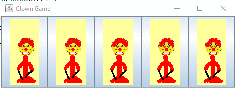

# Clown Game

:arrow_forward: Lab Starter Code

Welcome to this Lab :sparkles:

Please consult the course homepage for deadlines.


----
### Do NOT clone `L1-ClownGame-Starter` repository! :warning:

* A copy of this repository is made for you in your GitHub account. 
* The copied repository will appear as `lab1_teamxxx` (where `xxx` is some number). 
* Using IntelliJ, clone that repository and open it. 

---


#### Table of Context:

- [Overview](#overview)

- [Task 1](#task-1) 

- [Task 2](#task-2)

- [Task 3](#task-3) 

- [Submission](#submission)

  

---
### Overview

#### Description

The Clown Game is simple: 

- The game starts out with a list of clowns. As each clown is added to the list, it is set to either sitting or standing.

- You can then flip any clown in the list of clowns (by clicking on its image), but in doing so, you also flip the clown on either side of that clown!

- You win the game when you make all the clowns standing.




#### Learning Goals

This assignment requires you to use the following Java syntax:

- method invocation (e.g., `clown.isStanding();` `clownList.flip(3);`)
- variable assignment statements (e.g., `x=5;` `state=false;`)
- statements involving arithmetic and/or logical operators (e.g., `x + y` or `x < y;`)
- conditional branching (e.g., `if (...)` statement)
- foreach loops
- list operations:
  - the `list.get(x)` method  returns the object held at position `x` in the list. For instance: `myClown = clowns.get(0);` returns the `0`<sup>th</sup> Clown in the list `clowns`, and saves it to the variable `myClown`.
  - the `list.add(m)` method adds the object `m` to the list. So saying `clowns.add(c)` would add Clown `c` to the list `clowns`.
- If you find yourself trying to use additional syntax, talk to someone. You might be making it too hard!


---

### Task 1

Run the game and familiarize yourself with the codebase. 

We have provided you with a broken implementation of the Clown Game. It has a functioning user interface (in the `ui` package), and functioning (but incomplete) tests, but it is almost entirely missing the method implementations of the `ListOfClowns` class and of the `Clown` class.

It is your job to implement all the missing methods according to the specifications provided. 


---

### Task 2

Complete the implementation of the `ListOfClowns` and `Clown` classes so that they adhere to the specifications provided. 

**Hint**: No need to change any method unless we have put a `TODO` comment above it.  There are also comments written in the form `REQUIRES`, `MODIFIES` and `EFFECTS`.  You will soon be learning about what these mean, but for now, 

- `REQUIRES` indicates anything that needs to be true prior to the method running, or any constraints on parameters (if they have to be in a certain range, for instance), 
- `MODIFIES` indicates what data is changed by the method, and 
- `EFFECTS` describes what the method should accomplish.  


**Notes:**

1. When you open the project in the Packages view, you will find three packages: `ui`, `tests` and `model`. You ONLY need to modify the classes in the `model` package.  Leave the `ui` package untouched. 
2. You may add new tests or modify existing tests in the `tests` package as you like but it is not a requirement for this assignment. Your tests will not be marked.
3. We encourage you to read the tests in the `tests` package however. They may give you hints about how the methods are meant to work (the specifications are the best way to work that out but sometimes it's nice to have the usage context)


---


### Task 3
Once enough of the implementation is working, you should be able to play the game by running the `ClownGame` class in the `ui` package!! Have fun!


---

### Submission

To check your solution you will submit your project to AutoTest. 

Commit your code to your local repository and push it to the remote repository on GitHub.

Wait 2 minutes and then request the grade for your submission by entering the following as a comment on your commit.

```
@autobot #lab1
```

You'll be able to do this every 5 minutes. 

> `autobot` will respond with another comment on your commit that contains your grade for this lab.  


#### How does it work?

* The AutoTest grader will test your solution against a set of tests that we have defined (and whose code you cannot see) and it will tell you which of the tests failed to run correctly. 
* Your mark will be based on the number of our defined tests that your code passes but keep in mind that different tests carry different weights, so your score is not just the fraction of tests that pass.   
* AutoTest will also provide you with a score for *code coverage* but it is not used to determine your overall grade for this particular assignment.  


#### Before Submission

- Your code must compile prior to committing and pushing your code to GitHub.  
- You must also be careful not to have any unused import statements in your code.  

> This means there can be no red squiggles anywhere in your code and no greyed-out import statements.


#### Submission from IntelliJ:

1. Select `Commit`  from the `VCS` menu in `IntelliJ`. 
2. Enter a comment to describe the change you have made.
3. Hover over the "`Commit`" button and select "`Commit & Push`" from the pop-up menu.
4. Another dialog will pop-up - click the "`Push`" button.
5. Select `View → Tool Windows → Version Control`. (or `Alt+9`)
6. Click the `Log` tab and notice the comment that you just entered for your commit appears at the top of the list. 
7. Right-click on the comment and choose "`Open on GitHub`". This will open a web browser.
8. Look for a comment box towards the end of the page and leave the comment `@autobot #lab1`