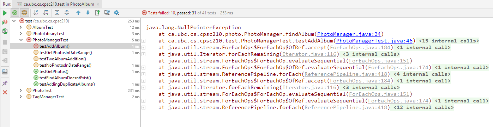
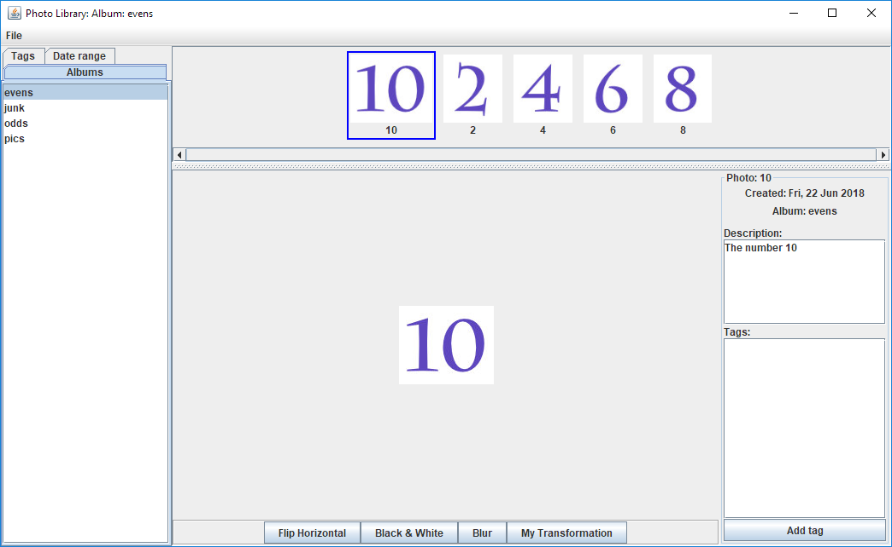

# Photo Album

:arrow_forward: Lab Starter Code

Welcome to this Lab :sparkles:

Please consult the course homepage for deadlines.


----
### Do NOT clone `L2-PhotoAlbum-Starter` repository! :warning:

* A copy of this repository is made for you in your GitHub account. 
* The copied repository will appear as `lab2_teamxxx` (where `xxx` is some number). 
* Using IntelliJ, clone that repository and open it. 

---


#### Table of Context:

- [Overview](#overview)

- [Task 1](#task-1) 

- [Task 2](#task-2)

- [Task 3](#task-3) 

- [Task 4](#task-4) 

- [Task 5](#task-5) 

- [Task 6](#task-6) 

- [Task 7](#task-7) 

- [Submission](#submission)

  

---
### Overview

#### Description

In this lab, we will work with a photo manager application. At the moment, the application contains several bugs - so you won't be able to use it until you have completed this lab. Notice that a suite of unit tests has been provided for you in the `tests` package. Run them by right-clicking the tests package, then choose *Run 'Tests in ca.ubc.cs.cpsc210.test'* - this will run all the tests in all the test classes found in this package.

Note that several of the tests fail. Some tests fail with a red icon - these are tests that did not run to completion. Others fail with an orange icon - these are tests that ran to completion but failed. During the lab you will use the failed tests in conjunction with the debugger to help you identify and fix the bugs.


#### Learning Goals

- use unit-tests in conjunction with the debugger to identify and fix bugs in code
- write unit-tests to achieve code coverage


#### Image Representation

One of the features of the photo manager application is that the user can perform some basic edits to the images. Some of the bugs lie in the methods that perform these edits. To fix them, you need to have a basic understanding of how images are represented in this application.

An image is made up of pixels, each of which has a colour. A two-dimensional coordinate system is used to identify a particular pixel in an image. The origin of this coordinate system is in the top-left corner of the image with the x axis running horizontally to the right and the y-axis running vertically down the image. So, if an image is 100 pixels wide and 50 pixels tall, the pixel at the top-left corner is at coordinate (0, 0) and the one at the bottom-right is at (99, 49).

The colour of each pixel is represented by an integer that encodes the red, blue and green components of that colour. Each of these components is represented by an integer value in the range 0 to 255, inclusive.

For example, the following image (which has been blown up) is 4 pixels wide by 4 pixels tall.


The red, green and blue components that make up the black pixel in the top-left corner are all zero. While those of the white pixel in the top-right corner are all 255 (the maximum integer value for a colour component). Other colours are obtained by mixing the red, green and blue components. So, for example, the pink colour on the top row is created by setting the red and blue components to 255 and the green component to 0.

How the red, green and blue components of a colour are combined together into a single integer is not important in the context of this lab. The easiest way to extract the components from a given integer or to create an integer that represents a particular colour is to use the `Color` class from the Java library. 

Take some time to familiarize yourself with the [documentation](http://docs.oracle.com/javase/7/docs/api/java/awt/Color.html) for this class. In particular, see the `Color(int r, int g, int b)` and `Color(int rgb)` constructors and the `getRGB()`, `getRed()`, `getGreen()` and `getBlue()` methods.


---

### Task 1

Run all the tests again but note that, having done it before, you can now do so by selecting *ca.ubc.cs.cpsc210.test in PhotoAlbumStarter* from the Run Configuration drop-down menu. 

Notice that `PhotoManagerTest.testAddAlbum` fails with a red icon. To investigate the problem, look at the right panel of the jUnit window.  You'll see a *stack trace* that shows the sequence of method calls that led to the `NullPointerException` in the code. Use this to identify the method that threw the exception.





> A `NullPointerException` is thrown when a variable whose value is `null` (and that has therefore not been initialized) is used to access a field or method of the corresponding type. 

Figure out which variable is `null`. You may want to use the debugger to step through the method that threw the exception to help figure this out or to verify your answer. Investigate why the variable is `null` and fix the bug.

> Hint: where should it have been initialized?  Use IntelliJ to help you jump to method definitions, so that you can investigate the source of the problem.  Look for hints from IntelliJ that something might be wrong in the code.  Remember that code in a grey font is redundant.  

Rerun the tests and make sure that `PhotoManagerTest.testAddAlbum` passes. Note that it's quite possible that fixing this bug may cause a few more tests to pass.

Once you're done, commit and push your code to GitHub.


---

### Task 2

For each of the following failing tests:

- `TagManagerTest.testRenameToSame`
- `PhotoLibraryTest.testRenameTagWithPhotos`

do the following:

1. carefully read the specification of the method being tested to make sure you understand its expected behaviour
2. determine if the bug is in the test or in one of the methods called by the test - keep in mind that there may be more than one bug that needs to be fixed before the test will pass!
3. for each bug that you find, identify the class and method that contains it
4. fix each bug 
5. re-run the tests and check that the test under consideration now passes

Once you're done, commit and push your code to GitHub.


---


### Task 3
Now consider the following tests:

* `PhotoManagerTest.testGetPhotosInDateRange` 
* `PhotoManagerTest.testNoPhotosInDateRange`. 

For each test what was the actual and expected value for the assertion that fails? Use this information to help you figure out the bug. You might also find it helpful to use the debugger to step through the `PhotoManager.findPhotosInDateRange` method.

In your text deliverables file (see the [Deliverables](#submission) section below), make a note of the code before and after the change.

Re-run the tests and make sure that the two tests mentioned above now pass.

We don't need to say it again, right? :stuck_out_tongue_winking_eye: By now you know that having completed a task, you should commit and push your code to GitHub so that you can revert your code to this point if you mess up badly on the next task.


---

### Task 4

Although there are still bugs in the system, you will have fixed enough of them at this point that you can run the application. Do so by right-clicking `PhotoLibraryApp` in the `ui` package, then select *Run `PhotoLibraryApp.main()`*. A number of images will be loaded into albums. Explore the different albums and the images found within them. Also take note of the description and tags (if any) for each image - this data (called *metadata*) was loaded from the image files.



Notice that there is a panel of buttons that perform various edits on the selected image - note that *My Transformation* doesn't do anything - yet! Select an image and convert it to black and white. Then try blurring it a few times. Finally, flip it horizontally. Notice that the last operation clearly did not work correctly. Rather than flipping the image horizontally, it performed a horizontal mirror image about the centre of the image. Also note that, although the image may have appeared to blur correctly, there is in fact a bug here too.

Run all the tests and notice that `PhotoTest.testFlipHorizontal` fails. Identify the bug and fix it, and, in your text deliverables file, make a note of any code that you change, before and after the change. Set a breakpoint in `TestPhoto.testFlipHorizontal`, debug the tests and step into the call to `flipHorizontal`. Note that the test runs on a small 4x4 image `TestImage.png` (open it from the `testPhotos` folder in IntelliJ). It therefore doesn't take long to step through the method, as there are only 16 pixels to process. As you step through the call to `flipHorizontal`, be sure to understand what each line of code is doing.


---

### Task 5

Run all the tests again and notice that `PhotoTest.testBlur` fails. The image is blurred by averaging each of the red, green and blue components of the pixels in the 3x3 neighbourhood centred at each pixel in the original image. So, for example, to compute the colour of the blurred image at the pixel marked with an X below, we average each of the red, green and blue components of the 9 pixels in the blue-shaded region: 

<p align="middle" >
 
</p>

If a pixel is on the edge or in the corner of the image, the 3x3 neighbourhood is reduced to include only pixels within the boundary of the image as illustrated by the blue-shaded regions below: 


<p align="middle" >
  
  &nbsp &nbsp &nbsp &nbsp
  
</p>


Identify the bug (be sure to check any helper methods) and, in your text deliverables file, make a note of any code that you change, before and after the change. 


---

### Task 6

Recall that, in this course, we will not write tests to explicitly check methods with very basic behaviour (for example, simple getters and setters). However, for methods with more interesting behaviour, we should check that we have full code coverage.

Configure IntelliJ to measure coverage of all the classes in the *photo* package when the tests in the test package are run, then run those tests with code coverage. Note that, for each class in the `photo` package, IntelliJ provides the % of methods and % of lines covered by the tests. Open up the `TagManager` class and notice that a couple of lines in `TagManager.renameTag` were not completely covered.

Open the `TagManagerTest` class and add a test so that the remaining lines of code in `TagManager.renameTag` are covered. Re-run the tests, with coverage, and check that you now have 100% coverage of the code in the `TagManager.renameTag`method. (In fact, you should now have 100% coverage of code in the `TagManager` class.)

Investigate the other classes in the `photo` package. Note that we do not have 100% coverage of all the code in all classes, however the methods not covered are very simple.


---

### Task 7

Here's your chance to get creative. Implement the method `Photo.myTransformation` so that it performs another kind of transformation on the selected image. You may want to re-read the [Image Representation](#image-representation) materials at this point to refresh your memory on how images are represented and how to work with colours. 

Note that your transformation must not consist only of calls to existing methods that transform the image. So, for example, your transformation cannot simply consist of a call to `flipHorizontal` followed by a call to `blur`. Verify that you obtain the expected results by running the program, clicking the *My Transformation* button and viewing the results. 

Keep in mind that this is a very basic check - we saw earlier that, even though the blur edit *appeared* to work correctly, it in fact contained a bug. Testing edits on images is a bit tricky in Java, so we don't expect you to write unit tests for this method.

Use the refactoring tools to rename `Photo.myTransformation` to something more descriptive of the edit that you have implemented.

Change the label on the *My Transformation* button to something more descriptive. In which package/class do you expect to find the corresponding code?


---

### Submission

Request a grade from AutoTest on the code you pushed to GitHub in the previous task by entering the following comment on your commit: 

```
@autobot #lab2
```

Note that you will have to wait 15 minutes between each successive request for feedback.  


> Your overall AutoTest score will be based on the *Test Summary* score *only* (so the extent to which your tests cover the code is not included in your overall AutoTest score for this lab *even though a code coverage score will be displayed by AutoTest*).  In other words, if your *Test Summary* score is 100%, you are done - you are not expected to reach 100% code coverage for this lab.  


#### Before Submission

- Your code must compile prior to committing and pushing your code to GitHub.  
- You must also be careful not to have any unused import statements in your code.  

#### Deliverables

Ensure that the following deliverables are committed and pushed to GitHub by the stated deadline. All text deliverables must be written in the` TextDeliverables.txt` file found in the `deliverables` folder of your project. Note that you will have to switch to **Project** view to access this file.
1. Text Deliverables:
	* The code that you changed (before and after) in Tasks [3](#task-3), [4](#task-4) & [5](#task-5).
2. Code Deliverables:
	* All the code that was modified during this lab.
