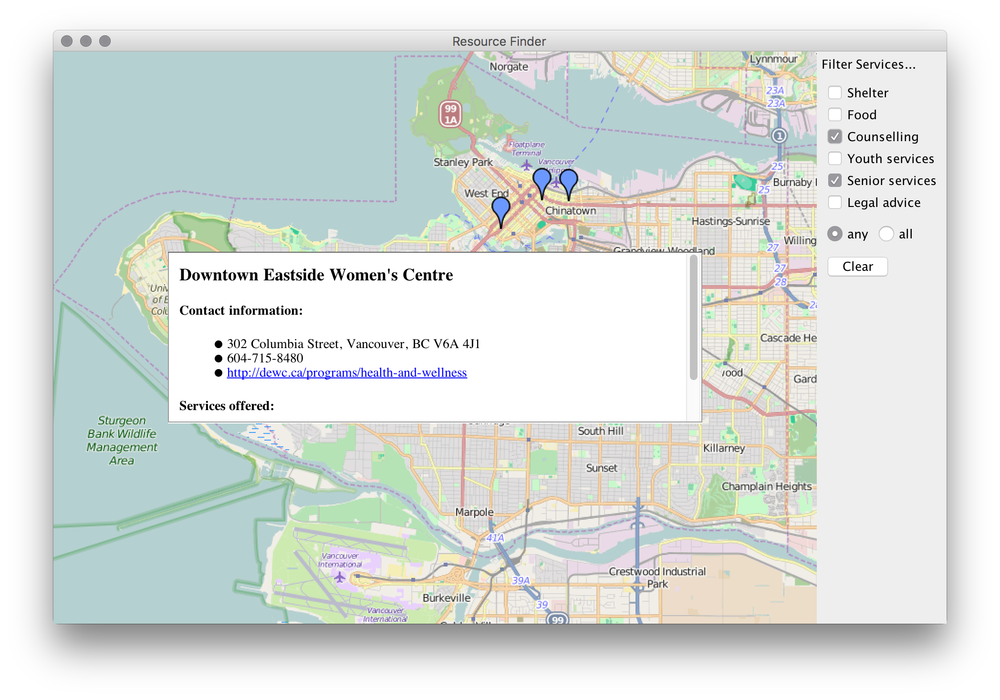

# Resource Finder

:arrow_forward: Lab Starter Code

Welcome to this Lab :sparkles:

Please consult the course homepage for deadlines.


----
### Do NOT clone `L3-ResourceFinder-Starter` repository! :warning:

* A copy of this repository is made for you in your GitHub account. 
* The copied repository will appear as `lab3_teamxxx` (where `xxx` is some number). 
* Using IntelliJ, clone that repository and open it. 

---


#### Table of Context:

- [Overview](#overview)

- [Task 1](#task-1) 

- [Task 2](#task-2)

- [Task 3](#task-3) 

- [Task 4](#task-4) 

- [Task 5](#task-5) 

- [Task 6](#task-6) 

- [Task 7](#task-7) 

- [Task 8](#task-8)

- [Submission](#submission)

  

---
### Overview


#### Learning Goals

- given the specification for a set of data abstractions that work together to model domain information:

- - design corresponding unit tests
  - implement the data abstraction

- use the Java Collections Framework (JCF) to store collections of objects

- filter collections of objects that meet specific criteria

- design unit tests to achieve code coverage


#### Description

In this lab you will be working on an application that will allow the user to search for social services offered by various organizations in Vancouver. We imagine that such an application would be part of a self-service kiosk available in public spaces such as the library.

Here's a snapshot of the final application:



Note that the user can select from a list of available services and request that corresponding resources be shown that offer *any of* or *all of* those services. The location of each resource is marked on the map. When the user clicks near one of those resources, a pop-up window provides corresponding contact information.

:mega: In this lab we will complete the 'model', that is, the design of classes that will be used to represent information in the domain of this application. In the next lab we will work on parsing data from a file that represents resources available in Vancouver.


---

### Task 1

Familiarize yourself with the `Resource`, `ContactInfo` and `GeoPoint` classes. Carefully read through the specification of the methods in the `ResourceRegistry` and `SelectionState`classes. Note that you will be testing and implementing these methods during the lab. 


---

### Task 2

We have already encountered the use of the `List` type in Java. In this lab, you will make extensive use of Java's `Set` type. Note that `Set` is an interface that has multiple implementations in the Java library. In this lab, you should use a `HashSet` - don't worry about what makes a `HashSet` a `HashSet` - all you need to know is that `HashSet` provides an implementation to the `Set` interface. The documentation for `Set` can be found here: [`java.util.Set`](https://docs.oracle.com/javase/8/docs/api/java/util/Set.html). Don't feel like you have to read the entire documentation but do take time to familiarize yourself with the operations available on a `Set`. Also keep in mind that you can iterate over the elements of a `Set` using a for-each loop (just as we've done for a `List`).

You will also be making use of Java's `List` type whose documentation can be found here: [`java.util.List`](https://docs.oracle.com/javase/8/docs/api/java/util/List.html). You may find that you need to create an empty list. A Google search may lead you to the `Collections.emptyList()` method. If you use this method, keep in mind that it produces an *immutable* list - in other words, a list that cannot be modified. So, if you want an empty list that will always be empty, this is an appropriate method to use. Otherwise, construct an empty list using the appropriate `ArrayList` or `LinkedList` constructor.

You should also review the methods of the [`java.util.Collections`](https://docs.oracle.com/javase/8/docs/api/java/util/Collections.html) class that produce **unmodifiable views** of lists and sets. 


---


### Task 3
Design unit tests for the constructor and for those methods specified in the `Resource` class that have interesting behaviour (in other words, don't design tests that specifically test the behaviour of simple getter and setter methods). A skeleton `ResourceTest` class has been provided for you in the `tests.model` package.

Reminder: on completion of this and all remaining tasks, be sure to commit and push your code to GitHub, so that you have a back-up in case anything goes wrong as you continue to work on this project.


---

### Task 4

Implement the methods specified in the `Resource` class. Run the unit tests that you designed in Task 3 and debug until all tests pass. When all the tests pass, run them with code coverage. Even though you have aimed to directly test only those methods with interesting behaviour, you should find that you have 100% code coverage of the `Resource` class, as all methods will have been used in the design of your tests. 


---

### Task 5

Design unit tests for the methods specified in the `ResourceRegistry` class that have interesting behaviour. Again, a skeleton test class has been provided for you in the `tests.model` package. Note that a helper method `loadResources` has been provided that adds services to resources and then adds those resources to a resource registry. Feel free to call this method from your tests when you need a resource registry loaded with sample data. Also feel free to design similar helper methods that creates a resource registry with a different state.

You will need to design a number of tests that check to see if a list of resources contains a particular resource. There's a pitfall here. When you design your tests, you must do it in such a way that you check to see if the list contains the same resource object that was inserted into the list, not that it contains a copy of that resource object.

So, for example, if the following test were added to the `ResourceRegistryTest` class:

```java
@Test
public void testAddOneResource() {
	testRegistry.addResource(r1);
	List<Resource> resources = testRegistry.getResources();
	assertEquals(1, resources.size());
	assertTrue(resources.contains(r1));
}
```

it would correctly check that the list referred to by the variable `resources` contains the resource `r1`. However, the following test would not be correct:

```java
@Test
public void testAddOneResource() {
    testRegistry.addResource(r1);
    List<Resource> resources = testRegistry.getResources();
    assertEquals(1, resources.size());
    Resource expected = new Resource("Res 1", null);
    expected.add(Service.FOOD);
    expected.add(Service.SHELTER);  // expected refers to a new resource object 
                                    // with the same name, contact info and set 
                                    // of services as the resource object 
                                    // referred to by r1

    assertTrue(resources.contains(expected));
                                    // test fails because r1 and expected do not
                                    // refer to the same Resource object (they
                                    // refer to different objects that have the
                                    // same name, contact info, etc.)
}
```

So be sure to use the first test above as a guide. Later in the course we'll say more about how the `contains` method works.


---

### Task 6

Implement the methods specified in the `ResourceRegistry` class. Run the unit tests that you designed in Task 5 and debug until all tests pass. When all the tests pass, run them with code coverage and make sure that you have 100% coverage of code in the `ResourceRegistry` class. 


---

### Task 7

We will now work on the `SelectionState` class. *This class represents the state of the user's selection - see the panel on the right hand edge of the screenshot provided in the [Overview](#overview).* So, when the user selects/deselects a service the `SelectionState.selectService/deselectService` method is called and the corresponding service is passed as an argument.

The method `SelectionState.setSelectAny` is called when the user clicks the *any* button and `SelectionState.setSelectAll` is called when the user clicks the *all* button. *These methods are therefore very simple setter methods used to track which button has been clicked by the user.*

Design unit tests for the methods specified in the `SelectionState` class that have interesting behaviour. Note that this class has several methods that modify "this" but only one method that allows you to inspect the state of "this". So you'll have to think carefully about how to test the specified behaviour. For example, to test that the constructor sets the selection state to *any* of the selected services, pass a registry that contains a number of resources. Then make a judicious selection of services that will allow you to distinguish between resources that contain *any* and resources that contain *all* of those services. Finally, call `SelectionState.getResourcesWithSelectedServices()` and check that the resources returned are those that contain *any*of the selected services.

Look for the skeleton test class that has been provided for you in the `tests.model` package. Note that a helper method similar to the one described in Task 5 has been provided. Again, you should feel free to add additional helper methods, as needed.

Again, you'll want to design tests to assert that lists or sets contain various resources. The notes provided in Task 5 above apply here too.


---

### Task 8

Implement the methods specified in the `SelectionState` class. Run the unit tests that you designed in Task 7 and debug until all tests pass. When all the tests pass, run them with code coverage and make sure that you have 100% code coverage for this class. Note that you should not expect to get 100% code coverage for all classes in the model package.  In particular,  the `ContactInfo`, `GeoPoint` and `Service` classes/enumerations have very simple implementations. They will be tested indirectly in the next lab when we continue the implementation of this application.


---

### Submission

Commit and push your code to GitHub and request a grade from AutoTest by entering the following comment on your commit:

```
@autobot #lab3
```

Note that your AutoTest score is based on how well your tests cover your implementation of the `Resource`, `ResourceRegistry`and `SelectionState` classes, and on the correctness of your implementation. 